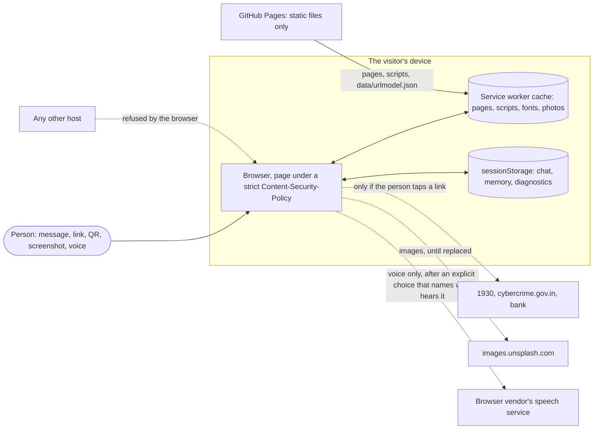
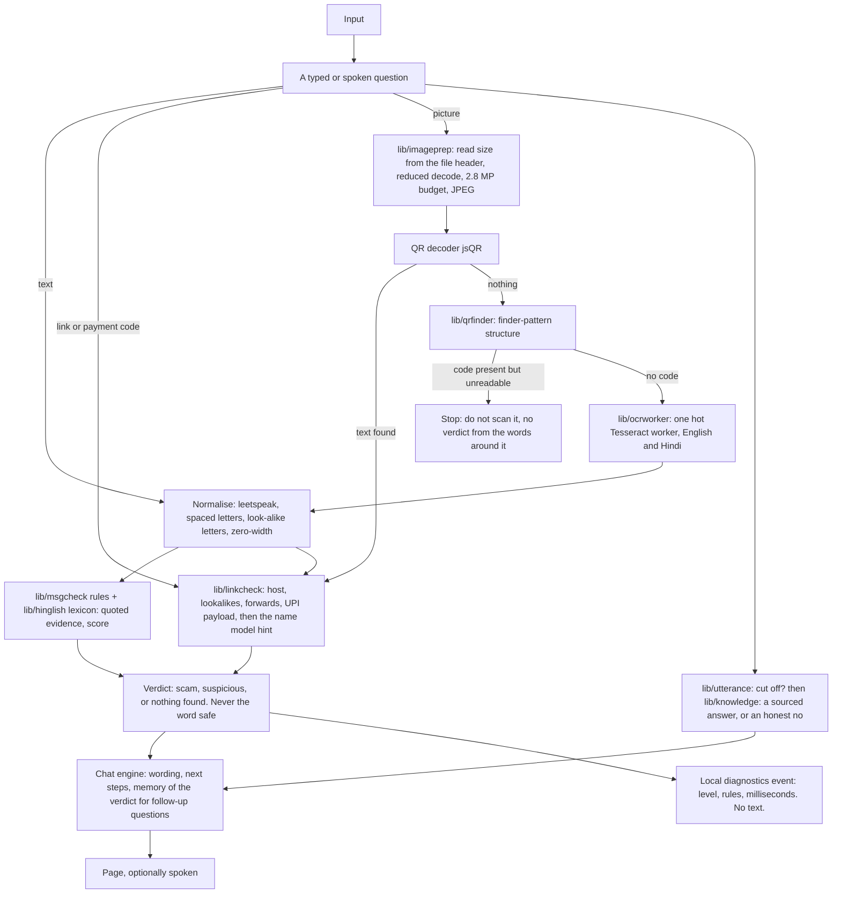
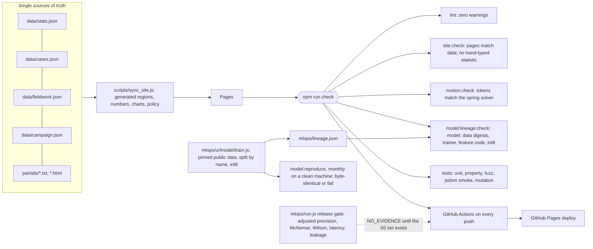

# Architecture

FraudShield is a static web app. Every check runs in the visitor's browser; there is no server of its own to send anything to. This page shows how a request moves through it, where the trust
boundaries are and how each is enforced, how the site and the model are built and verified, and why the main choices were made. Decisions are recorded one by one in [DECISIONS.md](DECISIONS.md) (26 ADRs);
measurements are in [BENCHMARKS.md](BENCHMARKS.md); what is stored where is in [PRIVACY.md](PRIVACY.md); what the tool reports about itself is in [OBSERVABILITY.md](OBSERVABILITY.md).

## 1. System context

Outbound connections from the page are limited to this site (`connect-src 'self' data:`); the only third-party host allowed at all is the photo provider, for images. The policy is one file, [`partials/csp.txt`](../partials/csp.txt),
written into every page by the build, and `npm run audit:pages` attacks it from inside a real browser (fetch, XHR, image, script, frame, beacon, inline script, eval): all refused.

## 2. What happens to one input

Properties that hold on every path, each with a test: a verdict is never "safe" (a clean check says "I found no known pattern", which is not proof); a rule names the exact words it matched; a link that forwards is judged by where it ends up;
a QR code that cannot be read stops the flow instead of falling back to its surrounding text; a follow-up question is answered about the last verdict, and "is it safe?" is never a yes; a question the tool has no answer for is said to be unanswerable, a pasted statement is never answered as if it were a question, and a half-spoken sentence is completed or called cut off, not guessed at.

## 3. Trust boundaries and how each is enforced

| Boundary | What could cross it | Enforced by | Verified by |
|---|---|---|---|
| Page to the network | a pasted SMS, a screenshot, a verdict | Content-Security-Policy (no foreign `connect-src`, no inline script, no eval); fonts, OCR engine and models served from the site | `tests/csp.test.js` (policy shape, every resource allowed, no off-site call in the code); `npm run audit:pages` (live attacks refused) |
| Page to the speech engine | microphone audio | on-device recognition first; otherwise an explicit one-time choice that names the recipient; no latching | `tests/smoke.test.js` (the mic never starts on load, idle or pointer movement) |
| Image to memory | a 48 MP camera frame | header read without decoding, reduced decode, pixel budget, one picture at a time, 25 MB / 150 MP refusal | `tests/imageprep.test.js`; real-Chrome 12 MP run in BENCHMARKS |
| Model file to the checker | a damaged or truncated download | validation before install; retry; loud status; verdicts say the check did not run | `tests/hardening.test.js`, `tests/urlmodel.test.js` |
| Event to the diagnostics buffer | text, links, numbers | named-field copy, enumerated values, size caps, vocabulary allow-lists | `tests/ops.test.js` (5,000 hostile events; nothing leaks) |
| Device to nobody | everything the tool stored | one button erases chat, memory, diagnostics and the voice choice | `tests/ops.test.js` |

## 4. How the site and the model are built and verified

The release gate (SPEC section 5) is built and tested but cannot pass yet: it needs a labelled set of real Indian messages (S0), which does not exist. It is therefore a visible, non-blocking job; making it blocking is deleting one line.

## 5. The three choices a reviewer asks about first

**Why offline-first and not a small API?** The input is the most sensitive thing a frightened person has: a bank SMS with balances and account numbers, a screenshot of a blackmail message. An API makes that a data-protection
liability for the author and a leak surface for the user; running in the browser removes both and also works on a bad connection (ADR-0004). The cost is real: no fleet-level monitoring and no server-side model updates without a deploy,
which is why observability is local (ADR-0022) and drift monitoring waits for volunteer-donated labelled messages (ADR-0018).

**Why Tesseract.js for reading screenshots, and not WebNN or ONNX Runtime Web?** Tesseract.js (v5.1.1, vendored with its English and Hindi language data, about 10 MB) runs offline in WebAssembly, supports Devanagari, and needed no model
conversion. An ONNX or WebNN OCR route would add a runtime of its own (ADR-0010 declined an ONNX runtime for the small linear models for the same reason: the runtime would be far larger than the model) plus a trained recognition model for Hindi and
English that would have to be found, converted, quantised and evaluated. Stated plainly: Tesseract was chosen on fit and effort, not benchmarked against those alternatives, and that comparison has not been done. What was measured is what
matters here: a hot worker reads three screenshots in 307 ms against 537 ms with a worker per picture (BENCHMARKS).

**Why rules first, and not an embedding or a classifier?** There is no labelled set of real Indian messages to train or test one on (ADR-0002), and a number from a public English corpus would be a proxy, not a measurement of this tool. A rule
quotes the words that triggered it, which is what a worried person can check and argue with; a model's score cannot. Where a learned signal did help it was kept small and honest: a 127 KB logistic regression on domain names, a hint that can
only raise "unverified" to "suspicious" (ADR-0014: AUC 0.768 on a proxy; a boosted model gained 0.008 AUC and was rejected). The next step is data, not a bigger model: the S0 set, then the gate.

## 6. Where to look

| I want to see | Open |
|---|---|
| the rules and what they quote | `lib/msgcheck.js`, `lib/hinglish.js`, `lib/linkcheck.js` |
| how pictures are handled | `lib/imageprep.js`, `lib/qr.js`, `lib/qrfinder.js`, `lib/ocrworker.js` |
| why the chat answers follow-ups | `lib/followup.js` |
| what the chat knows about itself, scams and the official routes, and how it declines | `lib/knowledge.js`, `lib/utterance.js`, [ADR-0023](DECISIONS.md) |
| the security policy | `partials/csp.txt`, [ADR-0015](DECISIONS.md) |
| the model's provenance | `mlops/lineage.json`, `npm run model:reproduce` |
| the measurements | [BENCHMARKS.md](BENCHMARKS.md) and the `bench:` and `audit:` scripts in package.json |
